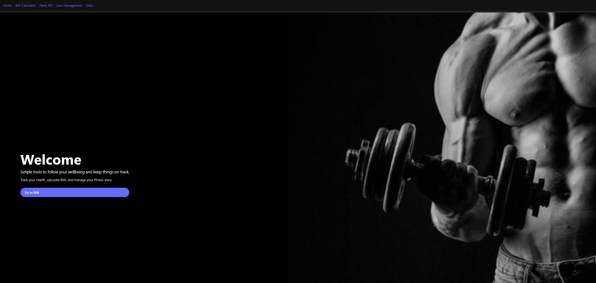
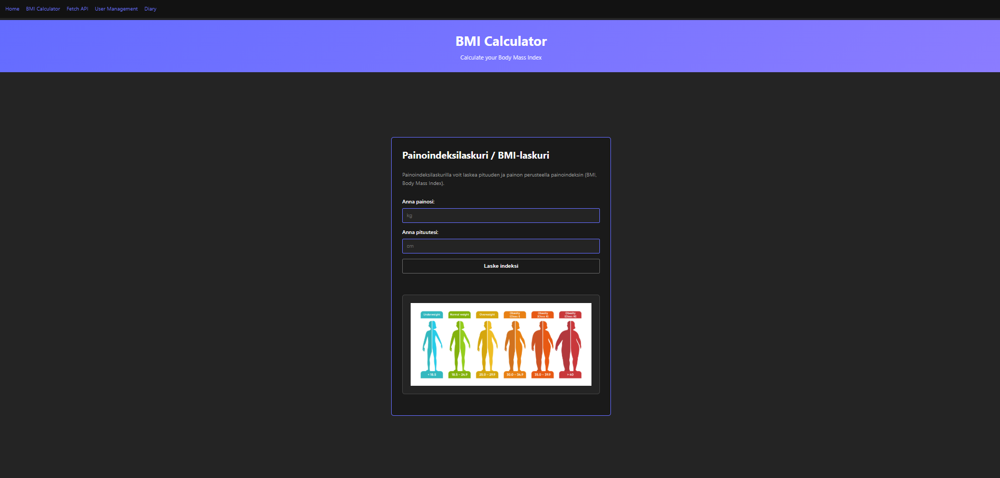
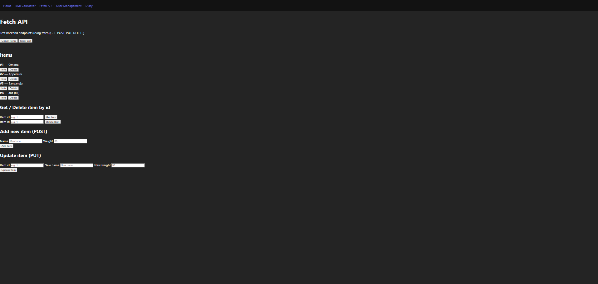
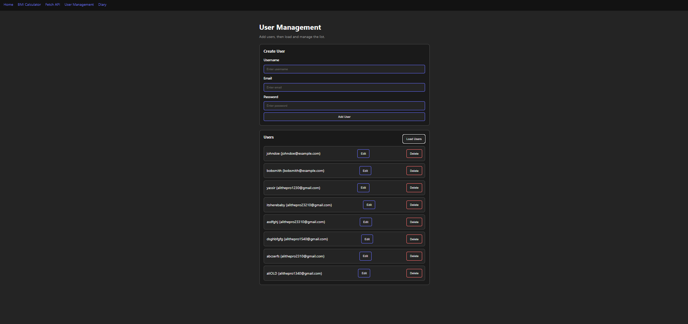
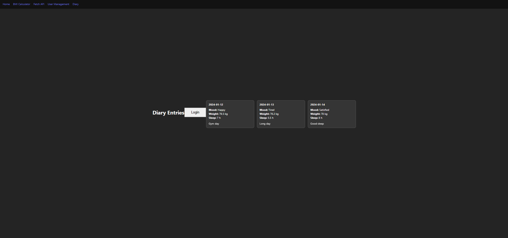

# Frontend Project

## 1. Project description
This is my frontend project.  
It is made with **HTML, CSS, JavaScript, and Vite**.

The app has these pages:
- Home page
- BMI Calculator page
- Fetch API page
- User Management page
- Diary page

The goal is to practice building a multi-page frontend and connecting it to backend API routes.

## 2. User interface screenshots
The screenshots below show the main pages of the frontend application.

### Home


### BMI


### Fetch API


### User Management


### Diary


## 3. Implemented features
- Simple navigation bar between all pages
- Full-screen landing section on Home page
- BMI calculator with result output
- Fetch API page for item requests (GET, POST, PUT, DELETE)
- User Management page to load, add, edit, and delete users
- Diary page with entry cards and a small login dialog UI

## 4. Backend connection (short)
Frontend uses Vite dev server and sends API calls with `/api/...` paths.  
In Vite config, `/api` is proxied to backend server at `http://127.0.0.1:3000`.

## 5. Possible bugs or limitations
- Error handling is basic in some places (mainly alert/toast style messages)
- UI is responsive, but still simple and can be improved more
- App depends on backend being running locally for API pages
- Some features are demo-level and not production-ready

## 6. References
- Vite docs: https://vitejs.dev/
- MDN Web Docs (HTML/CSS/JavaScript): https://developer.mozilla.org/
- Fetch API docs: https://developer.mozilla.org/en-US/docs/Web/API/Fetch_API

## 7. AI note
AI were used for small tasks like text formatting, structure suggestions, and small UI improvements.

## 8. How to run locally
```bash
npm install
npm run dev
Then open the local Vite URL (usually http://localhost:5173).